# 📘 Dokumentasi Pengguna — e-Jejak Anak

**Sistem Saringan Awal Perkembangan Kanak-kanak**
Kerjasama MAIK × USM (APEX)

> Dokumen ini menerangkan **cara menggunakan setiap portal** dalam sistem e-Jejak Anak, lengkap dengan tangkapan skrin (screenshot) paparan sebenar. Sesuai untuk rujukan ibu bapa, doktor, pentadbir dan superadmin.

---

## Kandungan

1. [Pengenalan](#1-pengenalan)
2. [Cara Akses & URL](#2-cara-akses--url)
3. [Peranan Pengguna & Akaun Demo](#3-peranan-pengguna--akaun-demo)
4. [Aliran Kerja Keseluruhan (Carta Alir)](#4-aliran-kerja-keseluruhan-carta-alir)
5. [PORTAL A — Ibu Bapa](#5-portal-a--ibu-bapa)
6. [PORTAL B — Doktor](#6-portal-b--doktor)
7. [PORTAL C — Pentadbir](#7-portal-c--pentadbir)
8. [PORTAL D — Superadmin](#8-portal-d--superadmin)
9. [Sistem Triage (Penilaian Automatik)](#9-sistem-triage-penilaian-automatik)
10. [Soalan Lazim & Nota Teknikal](#10-soalan-lazim--nota-teknikal)

---

## 1. Pengenalan

**e-Jejak Anak** ialah sistem berasaskan web yang membantu **ibu bapa mengesan tahap perkembangan anak** merentasi **5 domain utama**:

| Domain | Contoh Kemahiran |
|---|---|
| 🦶 **Motor Kasar** | Duduk, berjalan, melompat, naik tangga |
| ✋ **Motor Halus** | Menggenggam, menyusun blok, memegang pensel |
| 💬 **Bahasa** | Membebel, menyebut perkataan, memahami arahan |
| 👥 **Sosial** | Senyum, bermain bergilir, melambai |
| 🧠 **Kognitif** | Mencari objek, mengenal warna, mengira |

Sistem memaparkan **soalan mengikut umur anak** (dikira automatik daripada tarikh lahir), lalu menjana **keputusan saringan** dan **cadangan bahan pendidikan**. Doktor pula boleh menyemak keputusan dan menghubungi ibu bapa apabila perlu.

> ⚠️ **Penafian:** e-Jejak Anak menyediakan **saringan awal sahaja** — ia **bukan diagnosis perubatan**. Untuk pengesahan, sila rujuk profesional kesihatan.

---

## 2. Cara Akses & URL

Sistem dilayan melalui pelayan Apache (XAMPP):

| Portal | URL |
|---|---|
| Laman Utama (Ibu Bapa) | `http://localhost/ejejak-anak-mockup/index.html` |
| Log Masuk Ibu Bapa | `http://localhost/ejejak-anak-mockup/login.html` |
| Log Masuk Staf (Doktor/Pentadbir) | `http://localhost/ejejak-anak-mockup/admin-login.html` |

> **Penting:** Buka melalui `http://localhost/...` (bukan klik dua kali fail `.html`), supaya header, footer dan data berfungsi dengan betul.

---

## 3. Peranan Pengguna & Akaun Demo

Sistem mempunyai **4 peranan**. Kuasa (peranan) dan organisasi (USM/MAIK) adalah **bebas** — USM boleh ada pentadbir, MAIK boleh ada doktor.

### 🔑 Akaun Staf — log masuk di `admin-login.html`

| Peranan | Nama | E-mel | Kata Laluan | Organisasi |
|---|---|---|---|---|
| **Superadmin** | Webimpian | `superadmin@webimpian.com` | `demo1234` | Webimpian |
| **Pentadbir** | Pn. Salmah Ibrahim | `admin.maik@ejejakanak.my` | `demo1234` | MAIK |
| **Pentadbir** | En. Rosli Abdullah | `admin.usm@ejejakanak.my` | `demo1234` | USM |
| **Doktor** | Dr. Aminah Yusof | `doktor@ejejakanak.my` | `demo1234` | USM |
| **Doktor** | Dr. Zulkifli Hassan | `doktor.maik@ejejakanak.my` | `demo1234` | MAIK |

### 👪 Akaun Ibu Bapa — log masuk di `login.html`

| Nama | E-mel | Kata Laluan | Anak |
|---|---|---|---|
| Siti Nurhaliza | `ibu@contoh.com` | `demo1234` | Aisyah, Haziq |
| Farah Aziz | `farah@contoh.com` | `demo1234` | Nurin Damia |
| Amirul Hakim | `amir@contoh.com` | `demo1234` | Danish Iman |

### Ringkasan akses ikut peranan

| Peranan | Boleh buat |
|---|---|
| **Ibu Bapa** | Daftar sendiri · profil anak · saringan · keputusan · sejarah · tukar kata laluan |
| **Doktor** | Keputusan saringan · hubungi ibu bapa · urus soalan/domain · statistik · profil |
| **Pentadbir** | Statistik · urus artikel · urus pengguna (**org sendiri**) · laporan · log · profil |
| **Superadmin** | Semua kuasa pentadbir **merentas semua organisasi** · tidak boleh dipadam |

> **Nota:** Akaun staf **dicipta oleh pentadbir/superadmin sahaja** (tiada pendaftaran sendiri). Hanya ibu bapa boleh mendaftar akaun sendiri.

---

## 4. Aliran Kerja Keseluruhan (Carta Alir)

```
IBU BAPA:
  Daftar / Log Masuk → Tambah Profil Anak → Mula Saringan
      → Jawab checklist (ikut umur) → Hantar → Keputusan + Cadangan Pendidikan
      → (Sejarah saringan tersimpan)

DOKTOR:
  Log Masuk → Semak Keputusan Saringan (triage automatik)
      → Hubungi ibu bapa (Panggilan / WhatsApp / E-mel) → Tanda "Dihubungi"

PENTADBIR / SUPERADMIN:
  Log Masuk → Pantau Statistik → Urus Artikel → Urus Pengguna
      → Jana Laporan (CSV) → Semak Log Aktiviti
```

---

## 5. PORTAL A — Ibu Bapa

Portal utama untuk orang awam dan ibu bapa berdaftar.

### 5.1 Laman Utama (Beranda)

Halaman pendaratan sistem. Mengandungi *hero carousel*, ringkasan 5 domain, langkah "Cara Guna", dan pautan ke pendaftaran/saringan. Menu atas kekal sama di semua halaman.

- **Bar atas:** talian bantuan, e-mel, pautan **"Log Masuk Doktor"**, dan ikon media sosial.
- **Butang utama:** *Log Masuk* / *Daftar Percuma* di penjuru kanan atas.

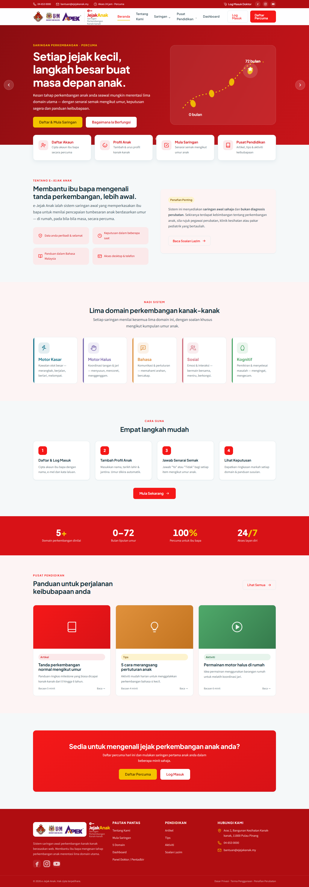

---

### 5.2 Log Masuk Ibu Bapa

**Langkah:**
1. Klik **Log Masuk** di menu atas (atau buka `login.html`).
2. Masukkan **e-mel** dan **kata laluan**.
3. Klik **Log Masuk** → dialihkan ke *Dashboard*.

> Borang demo sudah diisi dengan `ibu@contoh.com`. Jika e-mel belum berdaftar atau kata laluan salah, mesej ralat akan dipaparkan.

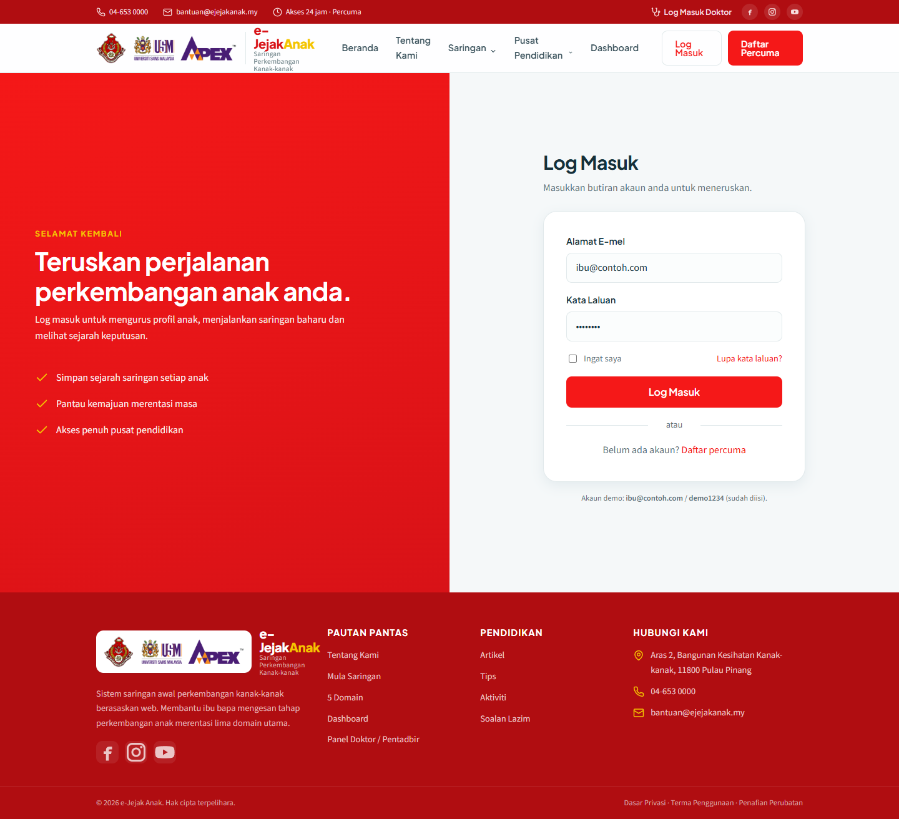

---

### 5.3 Daftar Akaun Baharu

**Langkah:**
1. Klik **Daftar Percuma** (atau buka `daftar.html`).
2. Isi **Nama**, **E-mel**, **No. Telefon** (wajib), **Kata Laluan** dan pengesahannya.
3. Klik **Daftar** → akaun dicipta dan terus log masuk ke Dashboard.

> **No. telefon adalah wajib** kerana doktor akan menghubungi ibu bapa melalui butiran ini apabila perlu.

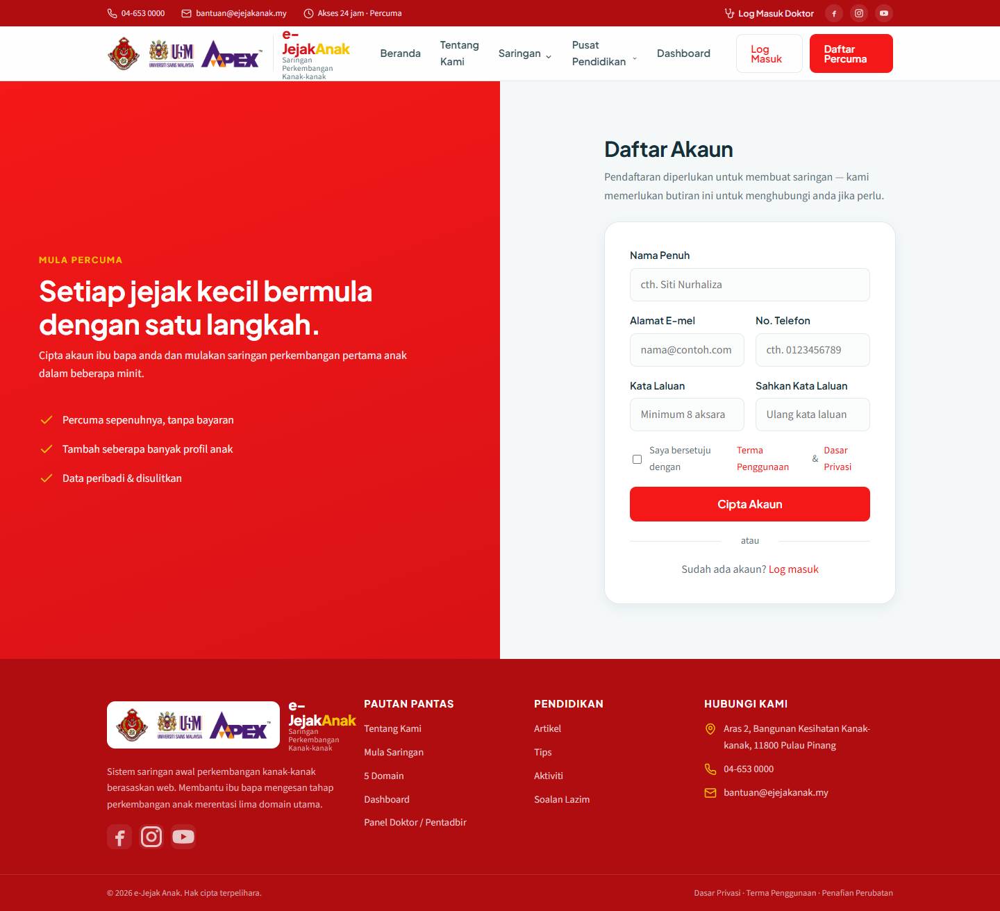

---

### 5.4 Lupa Kata Laluan

Masukkan e-mel akaun untuk menerima pautan set semula kata laluan (simulasi dalam mockup).

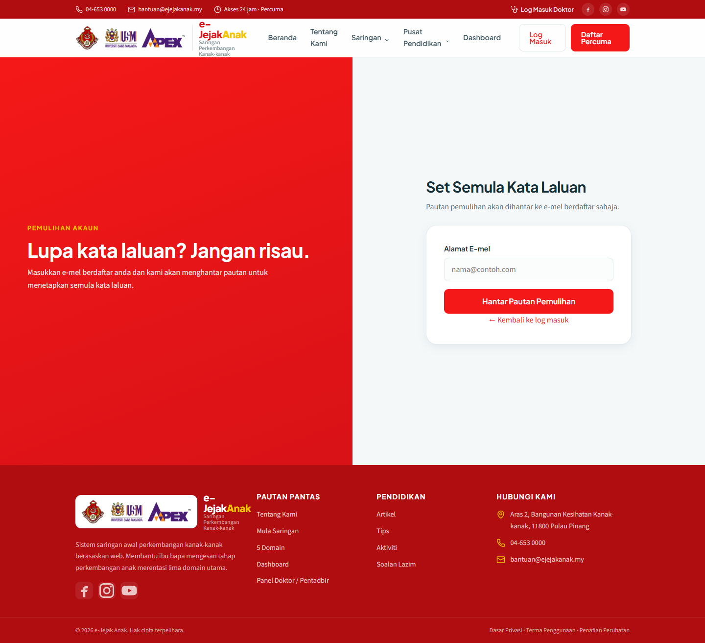

---

### 5.5 Dashboard Ibu Bapa

Selepas log masuk, ibu bapa melihat ringkasan dan senarai anak.

**Bahagian utama:**
- **Kad statistik atas:** bilangan profil anak, jumlah saringan selesai, purata kemahiran dicapai.
- **Kad setiap anak:** nama, jantina, umur auto, kumpulan umur, bilangan saringan & peratus terakhir.
  - **Mula Saringan** — mulakan saringan baharu untuk anak itu.
  - **Sejarah** — lihat semua saringan lampau anak.
  - **🗑 (Padam)** — buang profil anak.
- **Tambah Profil Anak:** isi *Nama Penuh*, *Tarikh Lahir*, *Jantina* → **Simpan Profil**. Umur dikira **automatik** daripada tarikh lahir.

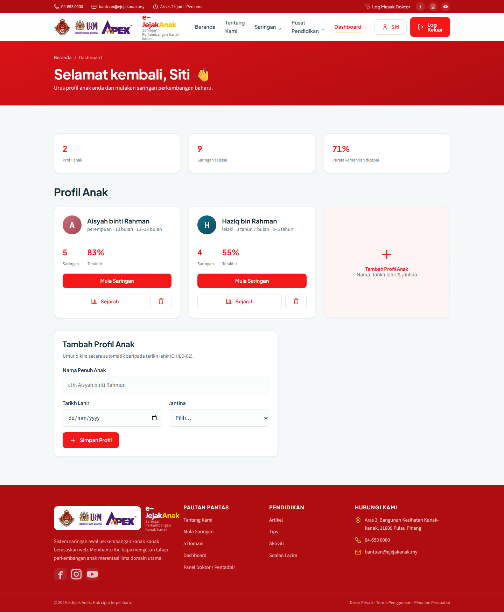

---

### 5.6 Saringan Perkembangan

Halaman ini memaparkan **senarai semak (checklist) mengikut umur anak**.

**Langkah:**
1. Pilih anak pada dropdown **Pilih Anak** (umur & kumpulan umur diisi automatik).
2. Baca panel biru — ia menyatakan bilangan soalan yang disesuaikan dengan umur anak.
3. Bagi setiap soalan, klik **✓ Ya** atau **Tidak**.
4. **Cincin peratus** dan bar "dijawab" di sebelah kiri mengemas kini secara langsung; navigasi domain menunjukkan bilangan soalan setiap domain.
5. Setelah **semua soalan dijawab**, klik **Hantar Saringan →**.

> Soalan **hanya dipapar jika sepadan dengan umur** anak (cth. bayi 18 bulan lihat 12 soalan; anak 42 bulan lihat set berbeza). Selepas dihantar, keputusan **tidak boleh diubah**.

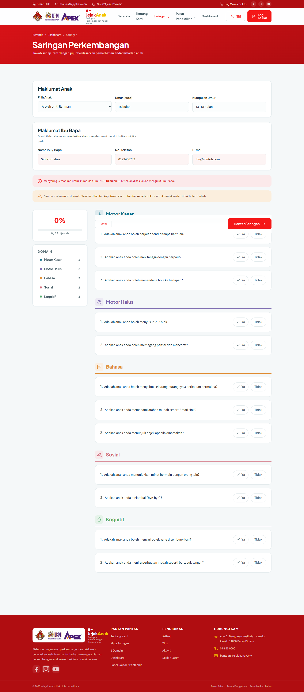

Contoh paparan setelah soalan dijawab (item bertanda selesai, kemajuan meningkat):

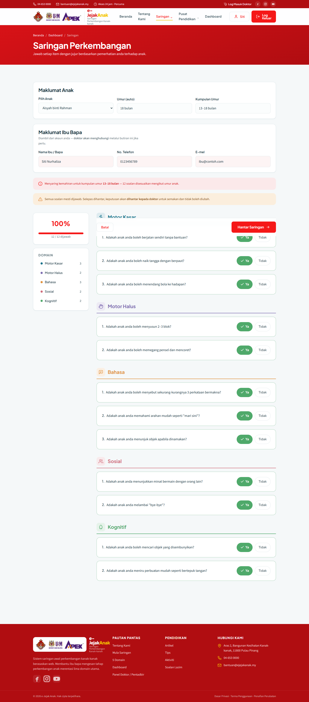

---

### 5.7 Keputusan Saringan

Selepas menghantar, ringkasan keputusan dipaparkan.

**Kandungan:**
- **Ringkasan markah:** jumlah kemahiran *dicapai* / *belum dicapai* / *jumlah*.
- **Skor setiap domain:** bar kemajuan peratus bagi setiap domain.
- **Nasihat automatik:** mesej berbeza jika terdapat kemahiran belum dicapai vs semua dicapai.
- **Cadangan Maklumat Pendidikan:** 3 artikel/tips/aktiviti berkaitan (mengikut Carta Alir).
- Butang **Cetak / Muat Turun PDF** tersedia.

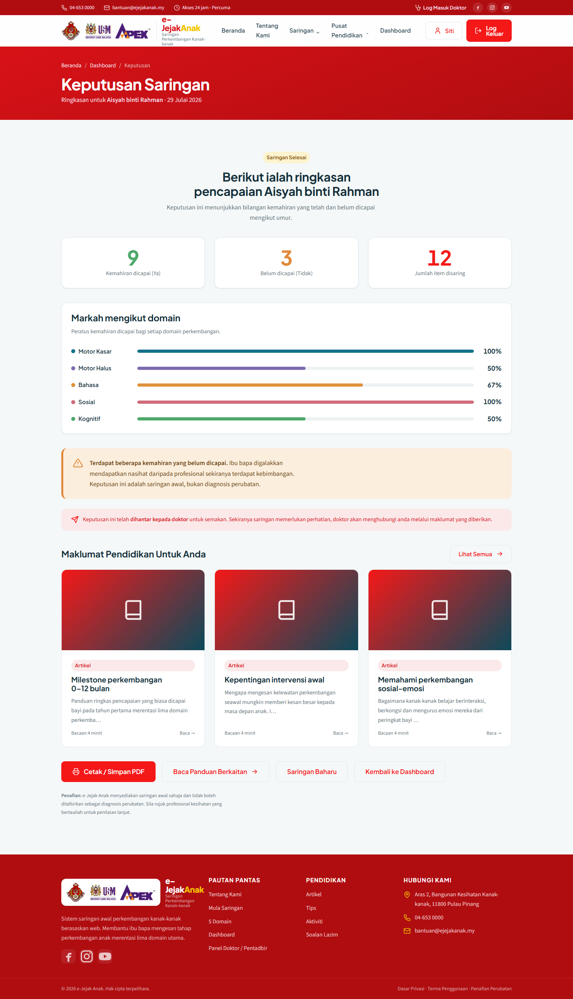

---

### 5.8 Sejarah Saringan Anak

Diakses melalui butang **Sejarah** pada kad anak di Dashboard.

**Kandungan:**
- Jadual semua sesi saringan lampau: **tarikh, umur, markah, triage**.
- Butang **👁 Lihat** membuka modal terperinci — skor domain + jawapan setiap soalan sesi itu.
- Butang **Cetak** dan **Muat Turun PDF** tersedia.

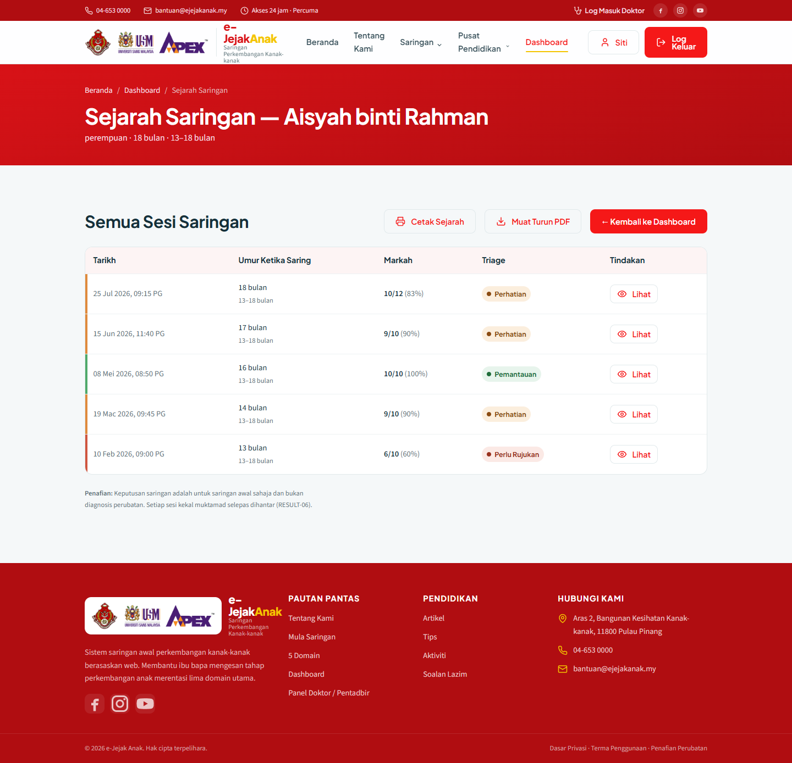

---

### 5.9 Profil Saya (Ibu Bapa)

Diakses dengan klik **nama pengguna** di menu atas.

- Butiran akaun (nama, e-mel, telefon) dipaparkan **baca-sahaja**.
- Ibu bapa hanya boleh **menukar kata laluan**: masukkan kata laluan semasa, kata laluan baharu (min. 6 aksara) dan pengesahannya → **Simpan**.

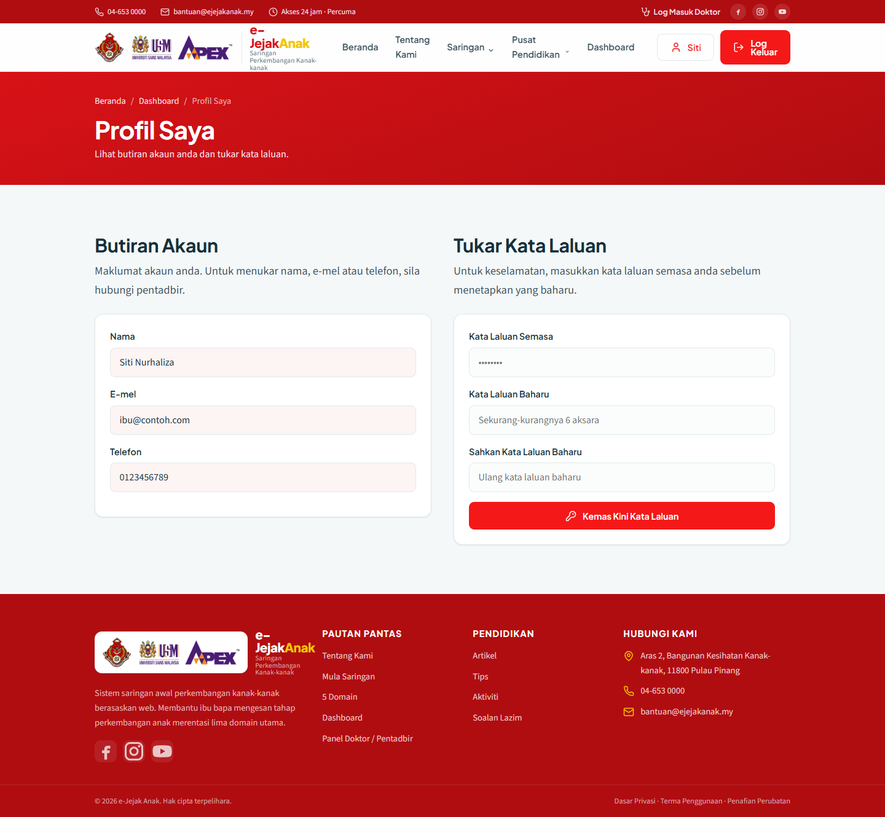

---

### 5.10 Pusat Pendidikan

Boleh diakses tanpa log masuk. Mengandungi bahan pendidikan yang **diurus oleh pentadbir**.

**Tab kandungan:**
- **Artikel Perkembangan** — panduan milestone, intervensi awal, dsb.
- **Tips Keibubapaan** — merangsang pertuturan, mengurus tantrum, rutin tidur.
- **Aktiviti di Rumah** — permainan motor halus/kasar, membaca bersama.
- **Soalan Lazim (FAQ)** — klik soalan untuk kembang jawapan.

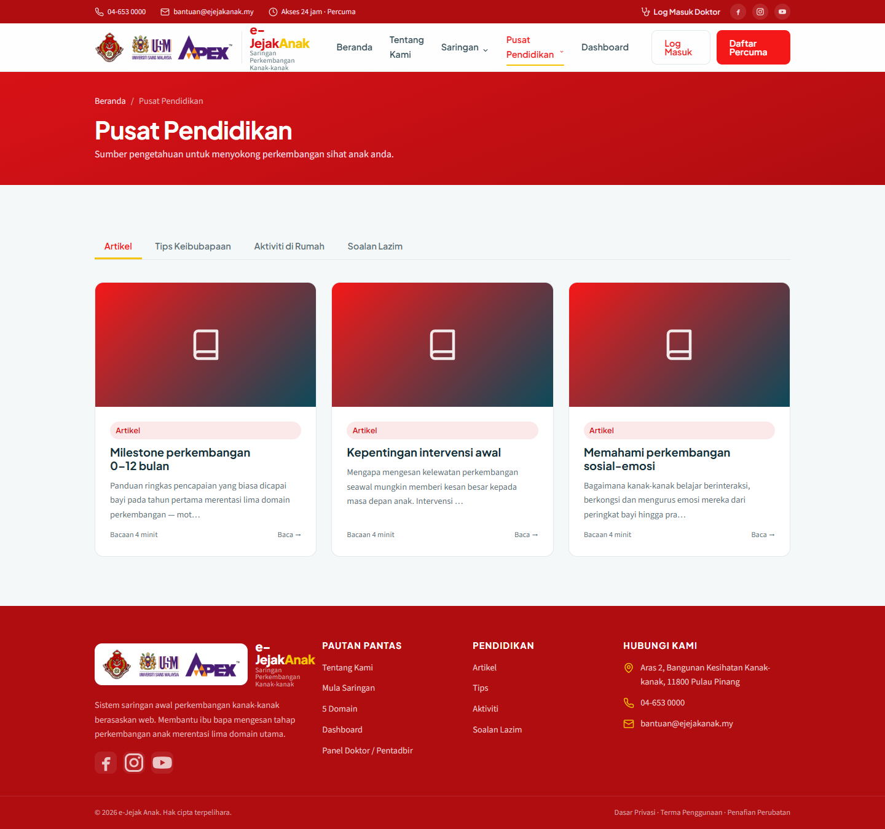

---

## 6. PORTAL B — Doktor

Portal klinikal untuk menyemak keputusan saringan dan menghubungi ibu bapa.

### 6.1 Log Masuk Staf

Buka `admin-login.html` (atau klik **"Log Masuk Doktor"** di bar atas laman utama). Masukkan e-mel & kata laluan staf.

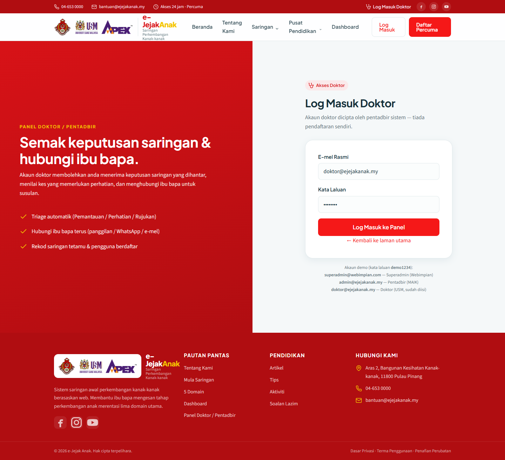

> Panel yang dipaparkan selepas log masuk **berbeza mengikut peranan** akaun (doktor / pentadbir / superadmin).

### 6.2 Tab: Keputusan Saringan

Tab utama doktor. Memaparkan **semua saringan yang diterima** daripada ibu bapa.

**Ciri:**
- **Kad ringkasan atas:** jumlah saringan diterima · baharu (belum dihubungi) · perlu rujukan.
- **Carian & penapis:** cari nama anak/ibu bapa, tapis mengikut **Triage** dan **Status**.
- **Jadual saringan:** anak, ibu bapa, tarikh hantar, **markah & triage** (🟢 Pemantauan / 🟡 Perhatian / 🔴 Perlu Rujukan), status.
- **Tindakan setiap baris:**
  - **👁 Lihat** — buka butiran penuh saringan (skor domain + jawapan).
  - **📞 Hubungi** — pilih **Panggilan / WhatsApp / E-mel** dengan mesej pra-isi; sistem merekod **siapa** menghubungi dan **bila**, lalu boleh ditanda **"Sudah Dihubungi"**.

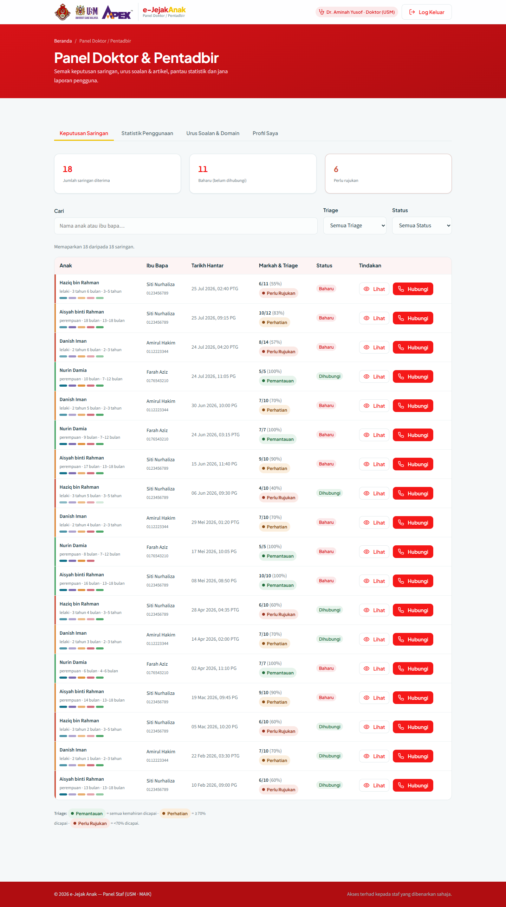

### 6.3 Tab: Statistik Penggunaan

Ringkasan penggunaan sistem: jumlah pendaftaran, profil anak, saringan selesai, pengguna aktif, purata pencapaian, dan **purata setiap domain** (termasuk carta trend).


### 6.4 Tab: Urus Soalan & Domain

Doktor boleh menyelenggara kandungan saringan:
- **Tambah / padam soalan** pada mana-mana domain (dengan **kumpulan umur** soalan).
- **Cipta domain baharu** (nama, warna, ikon, senarai soalan).

Perubahan terus terpakai pada checklist saringan ibu bapa.

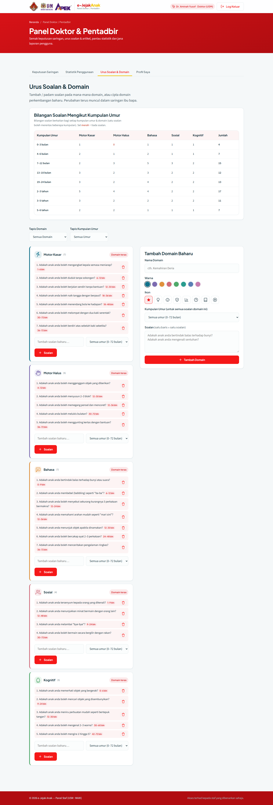

### 6.5 Tab: Profil Saya

Doktor melihat & mengemas kini butiran profil sendiri. (Doktor **tidak** mengurus akaun pengguna lain.)

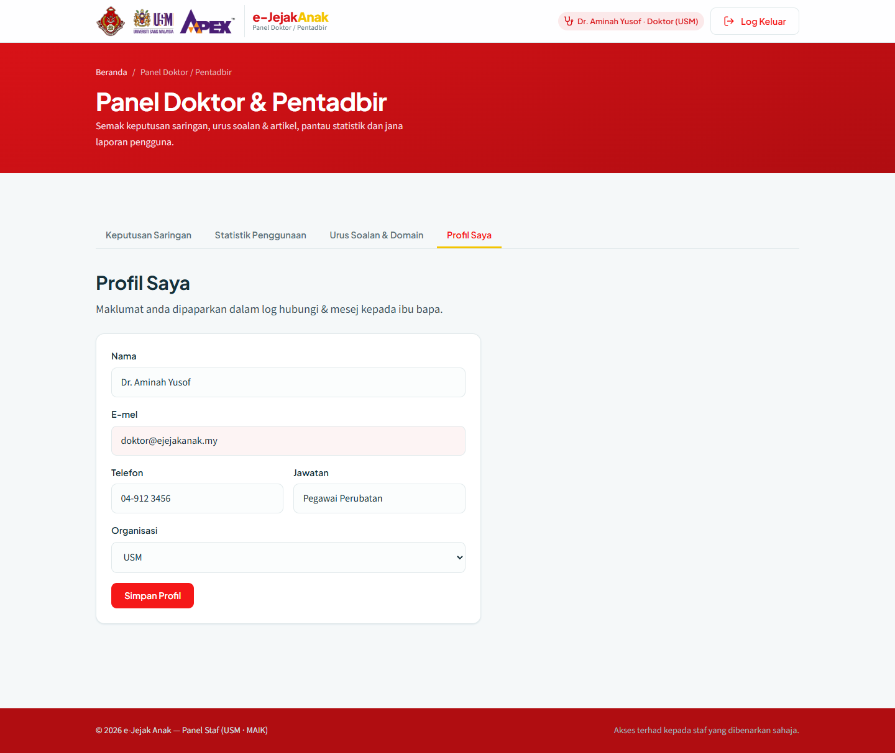

---

## 7. PORTAL C — Pentadbir

Portal pengurusan untuk pentadbir organisasi (MAIK / USM). Log masuk di `admin-login.html`. Pentadbir hanya melihat & mengurus akaun **dalam organisasinya sendiri**.

### 7.1 Tab: Statistik Penggunaan

Sama seperti paparan doktor — pemantauan penggunaan sistem secara keseluruhan.

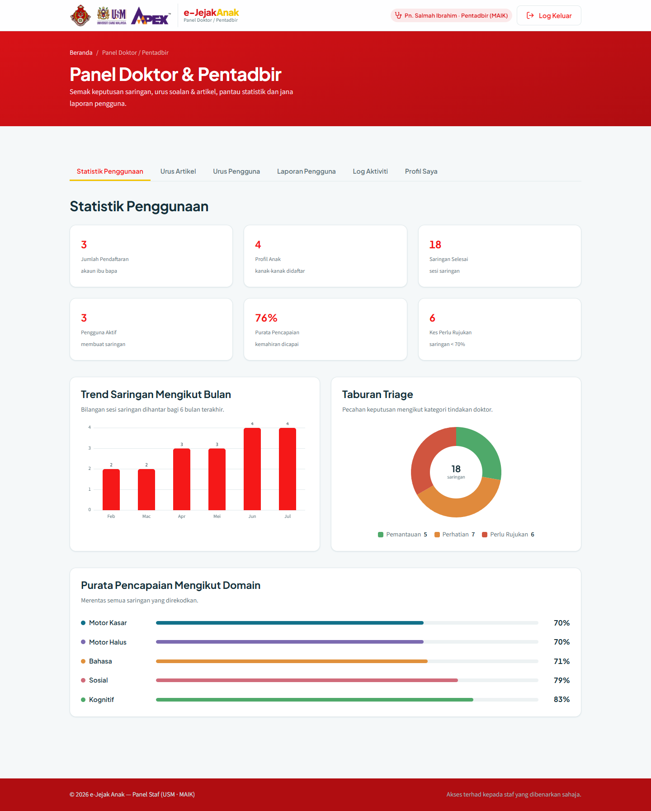

### 7.2 Tab: Urus Artikel

Mengurus semua kandungan **Pusat Pendidikan**:
- **Tambah / sunting / terbit / padam** Artikel, Tips, Aktiviti dan FAQ.
- Perubahan **terus dipaparkan** di halaman Pusat Pendidikan (`pendidikan.html`).

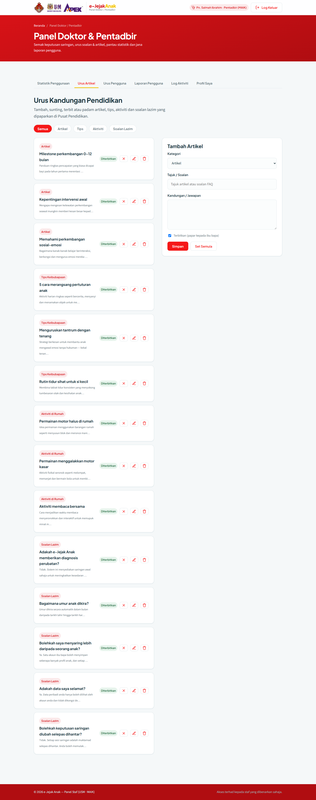

### 7.3 Tab: Urus Pengguna

Jadual **bersatu** ibu bapa + staf, dengan carian dan penapis **User Level** (Ibu Bapa / Doktor / Pentadbir).

**Tindakan setiap baris:**
- **Sunting** butiran · **Lihat** · **Set Semula Kata Laluan** (ikon 🔑) · **Padam**.
- **Login as** — menyamar sebagai pengguna itu untuk sokongan (bar "Mod Penyamaran" akan muncul).
- **Tambah Akaun Baharu** — modal untuk cipta akaun staf (nama, e-mel, telefon, peranan, organisasi, kata laluan).

> Pentadbir hanya nampak baris dalam organisasinya; organisasi dikunci semasa cipta akaun.

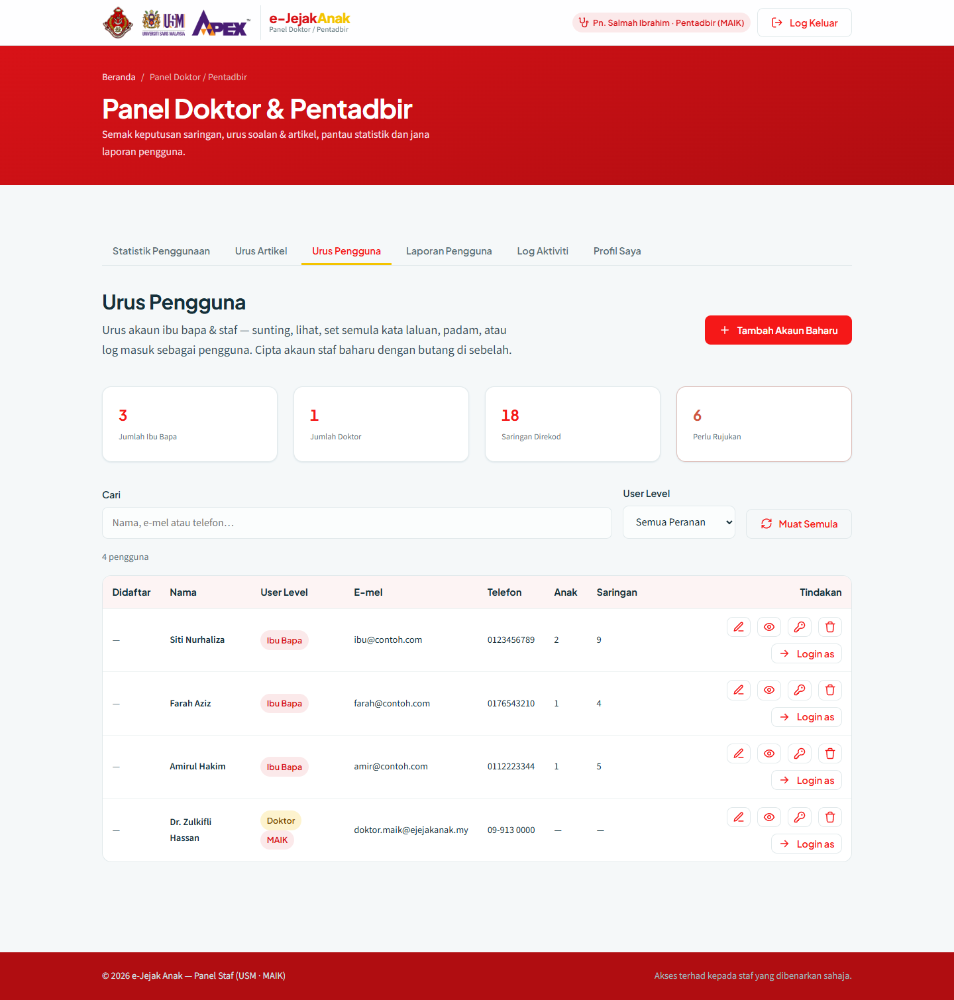

### 7.4 Tab: Laporan Pengguna

Jadual pengguna dengan butang:
- **Muat Turun CSV** — eksport data pengguna.
- **Lihat Laporan** — modal ringkasan dengan jawapan boleh dikembang; boleh **Cetak / PDF**.

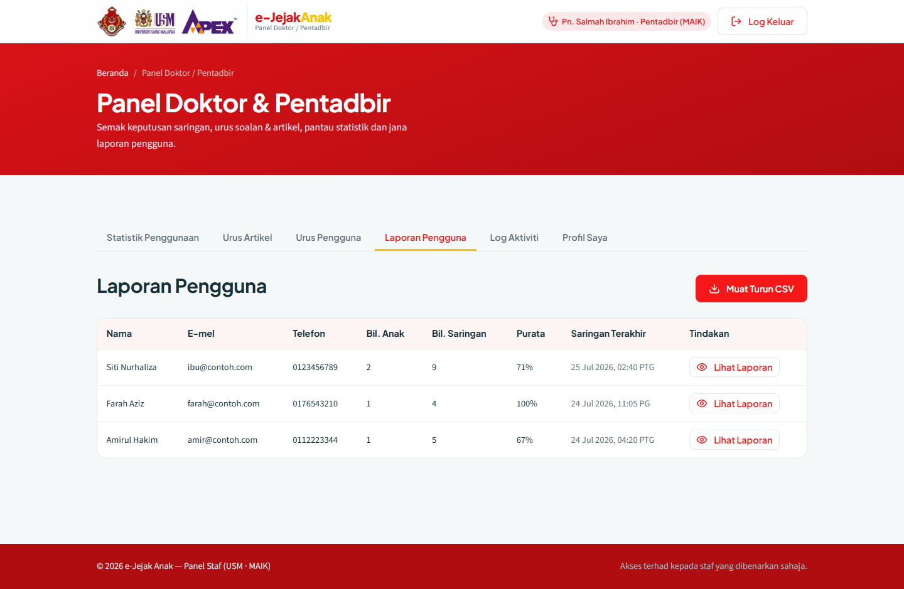

### 7.5 Tab: Log Aktiviti

Rekod audit tindakan sensitif: log masuk, cipta/padam akaun, hubungi ibu bapa, eksport laporan, tambah soalan, dsb. Setiap baris menunjukkan **tarikh, pelaku (nama + peranan + organisasi), tindakan, butiran**.

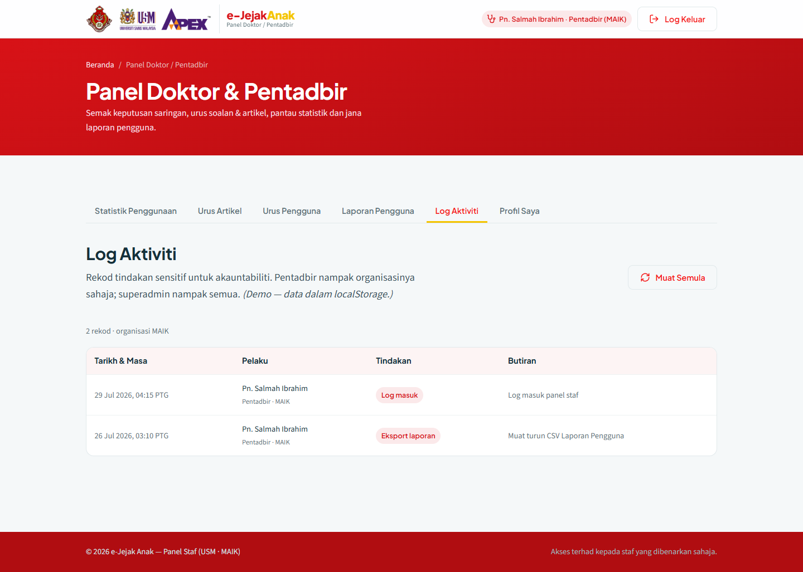

---

## 8. PORTAL D — Superadmin

Peranan tertinggi (Webimpian). Log masuk di `admin-login.html` dengan `superadmin@webimpian.com`.

**Perbezaan berbanding Pentadbir:**
- Melihat & mengurus akaun **merentas SEMUA organisasi** (USM, MAIK, Webimpian).
- Boleh **menyamar sebagai pentadbir & doktor** mana-mana organisasi.
- Akaun superadmin **tidak boleh dipadam** atau disamar.

### 8.1 Urus Pengguna (semua organisasi)

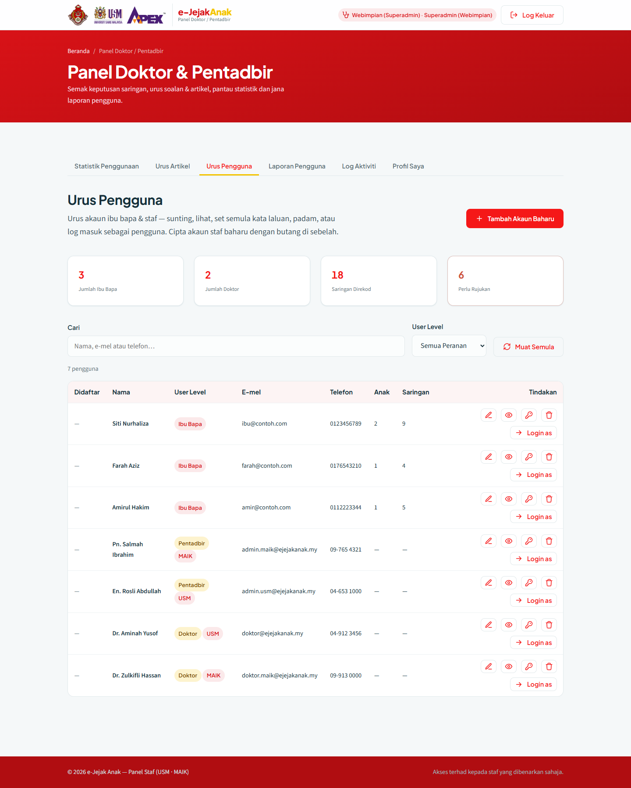

### 8.2 Profil Saya & Urus Akaun

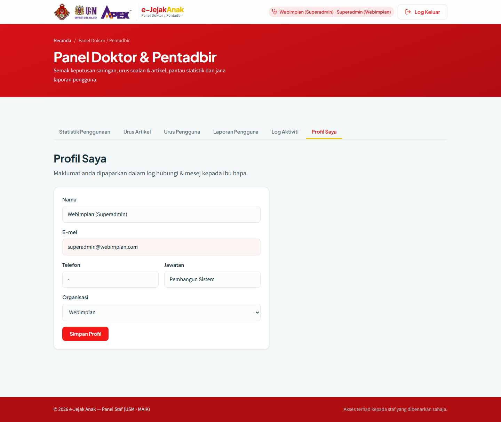

---

## 9. Sistem Triage (Penilaian Automatik)

Setiap keputusan saringan dilabel automatik mengikut peratus kemahiran dicapai:

| Triage | Maksud | Kriteria |
|---|---|---|
| 🟢 **Pemantauan** | Semua kemahiran dicapai | 100% dicapai |
| 🟡 **Perhatian** | Kebanyakan dicapai | ≥ 70% dicapai |
| 🔴 **Perlu Rujukan** | Ramai belum dicapai | < 70% dicapai |

Label ini membantu doktor mengutamakan kes yang perlu dihubungi dahulu.

---

## 10. Soalan Lazim & Nota Teknikal

**Bagaimana umur anak dikira?**
Automatik dalam bulan, daripada tarikh lahir ke tarikh hari ini. Ibu bapa tidak perlu masukkan umur secara manual.

**Bolehkah menyaring lebih daripada seorang anak?**
Ya — satu akaun boleh menyimpan banyak profil anak, setiap satu dengan sejarah tersendiri.

**Bolehkah keputusan diubah selepas dihantar?**
Tidak. Setiap sesi adalah muktamad. Ibu bapa boleh mula saringan baharu bila-bila masa.

**Adakah ini diagnosis perubatan?**
Tidak. Ini saringan awal untuk meningkatkan kesedaran — bukan pengganti penilaian klinikal.

### Nota Teknikal (untuk pembangun / demo)

- Ini **mockup antara muka** — data disimulasi menggunakan `localStorage` / `sessionStorage` pelayar (tiada backend sebenar).
- Data contoh (akaun, anak, saringan 6 bulan, artikel) **diisi automatik** pada bukaan pertama.
- **Set semula data demo:** jalankan `localStorage.clear()` di konsol pelayar (F12), kemudian muat semula halaman.
- ⚠️ Kata laluan `demo1234` untuk demo sahaja — jangan guna dalam sistem sebenar.

---

*Dokumen dijana untuk sistem e-Jejak Anak (mockup). Tangkapan skrin diambil pada resolusi desktop 1440px daripada paparan sebenar sistem.*
